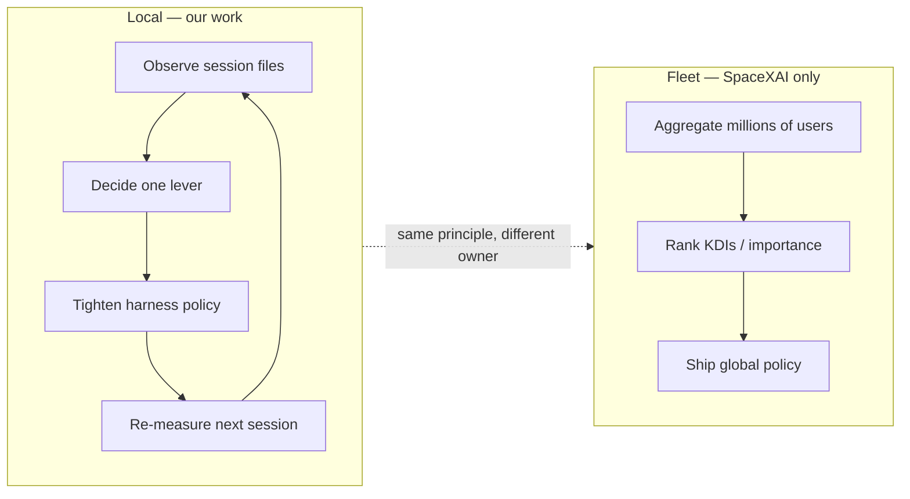
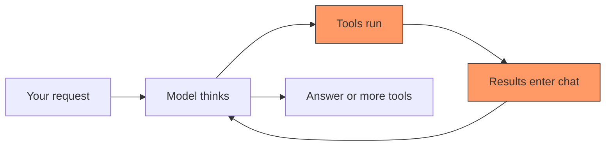
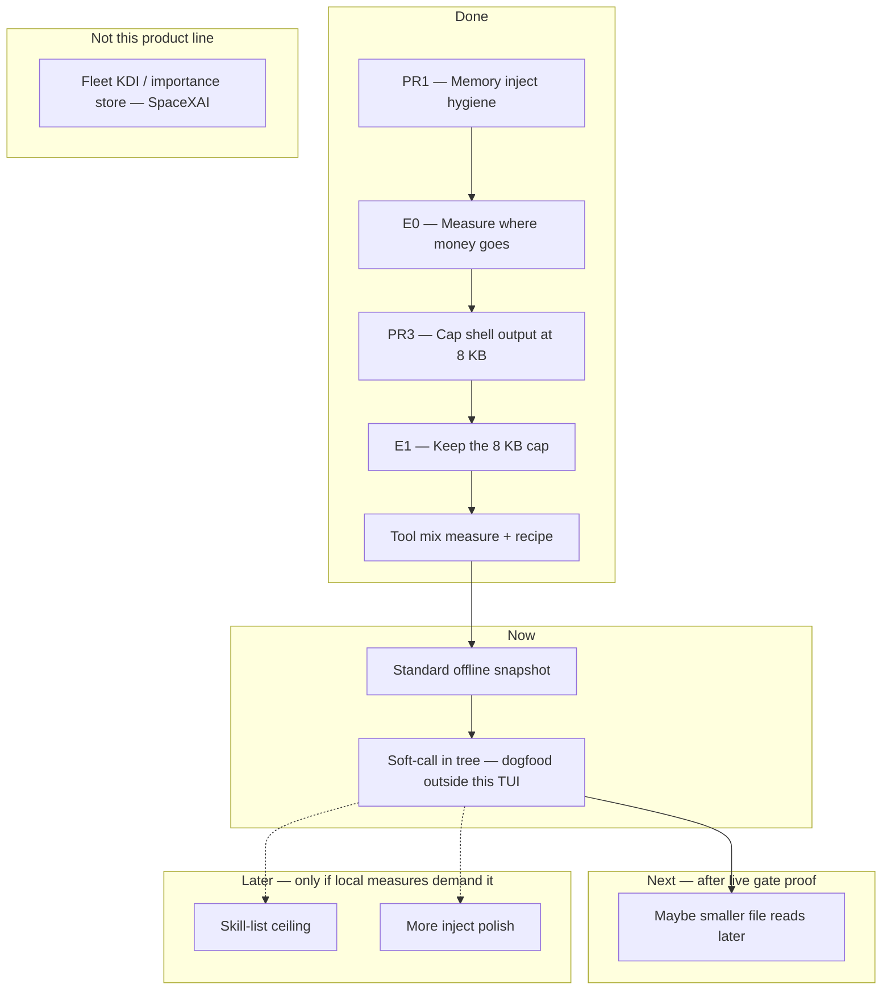
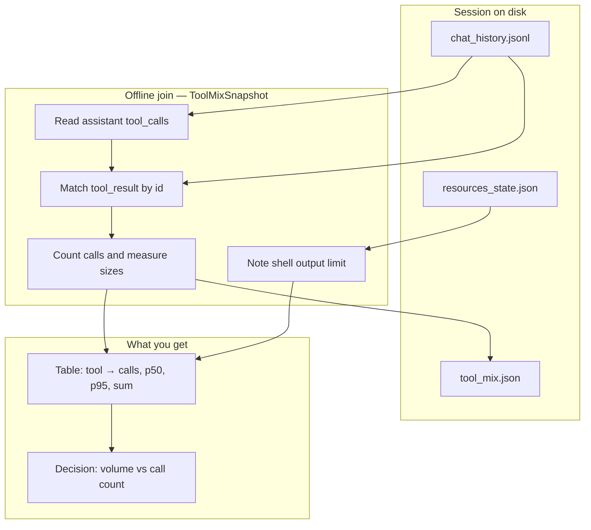
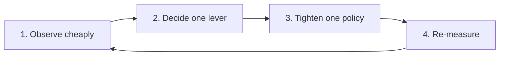
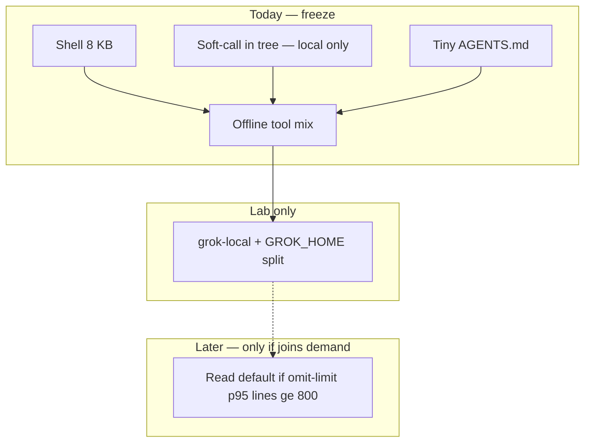

# Where we are going (and what we already fixed)

**Project:** Grok Build harness — cut learning cost (tokens, tools, money) without building features we do not need.  
**Date:** 2026-08-14 (unit of account + cheap measure recipe; earlier loop 2026-08-06)  
**Audience:** future you, and any agent that resumes this work.

This note uses plain words. It avoids code-names unless it first says what they mean.

> **Folder:** `intelli-arch-designs/` — product-line design notes (direction, measures, next lever).  
> **Not** the end-user guide — that lives under `crates/codegen/xai-grok-pager/docs/user-guide/`.  
> **Operator memory mirror:** `~/.grok/memory/grok-build-fd8a03ef/harness-learning-cost-roadmap.md`

---

## One sentence goal

Make the agent **learn and ship code with less waste**: fewer huge tool dumps, fewer needless tool rounds, and fewer “measure by running a whole other agent” loops.

The product we edit **is** the harness we run. Saving tokens here pays every session after.

---

## Scope: local learning loop only

North star essay: [Focus — Make the learning loop more efficient](https://peramanathan-sathyamoorthy-cv.vercel.app/focus).

That essay describes a virtuous cycle (measure → learn importance → reduce measurement → improve decisions). **This product line only runs the cycle locally** — on one operator’s machine, from session files already on disk.

| Loop | Who | What “learn” means here | In scope? |
|------|-----|-------------------------|-----------|
| **Local learning loop** | You + this harness | Offline join of `chat_history.jsonl` / `tool_mix.json` → pick **one** policy lever → tighten → re-measure next sessions | **Yes — this is the roadmap** |
| **Full-scale learning loop** | SpaceXAI (fleet / millions of users) | Cross-user importance ranking, shared KDIs, central policy that “learns which signals matter” at product scale | **No — out of scope** |

We reuse the *shape* of the focus essay (observe cheaply → tighten → sparse improvement). We do **not** build the cloud/fleet half that only a provider with millions of sessions can run honestly.



**Translation for agents:** when this note says “learn,” it means *local observe → one change → measure again*. It does **not** mean train an importance model, stand up a KDI store, or wait for fleet telemetry.

---

## The problem in plain terms

When you work with the agent, most of the bill is **not** the system prompt or the skill list.

It is this loop:

1. The model calls tools (shell, read file, search, …).
2. Each tool result is stuffed back into the chat.
3. The next model call pays for **all of that history again**.

So cost scales with:

**how many tools you call × how big each result is × how many rounds you take.**



**Red boxes** are where money burns. Fix those first.

### Unit of account (do not mix these)

Borrowed from [economy-first-principles](file:///home/sustainableabundance/life-os/Resources/economy-first-principles.md): **spending is the metabolism; wealth is title; market cap is the sticker.** Do not add the lakes.

| Name | What it is here | Optimize? |
|------|-----------------|-----------|
| **GDP / river** | Useful output per dollar (task done, PR shipped, **no extra re-prompt**) | **Yes — this is the unit of account** |
| **FX / invoices** | `tool_mix`: calls × result chars × rounds. Same text billed again next model call | Watch. Tax hops. Not the goal. |
| **Market cap / sticker** | HUD context %, `signals.json` `contextTokensUsed` / `contextWindowUsage` | Thermometer only |
| **Stock / lake** | Memory, skills, session files, policy knobs, full bash logs on disk | Compound; do **not** restuff into the model |

**Do not add** inject + skills + tools as three separate “cost piles.” They share one window (household wealth already includes the equity). E0: inject ≪5%, skills ~2%; tools dominate.

**Value-added vs invoices:** GDP counts leftovers once. A 16 kB `read_file` that is never used is an invoice, not output. After a result is consumed, the next prompt should keep the **decision**, not re-bill the dump.

**Jevons:** cheaper / faster models → *more* tool storms unless hop count is taxed. Soft-call stays even when inference “feels cheap.”

---

## What we have already done

### Map of progress



### Done in detail

| Step | What we did | What we learned | Status |
|------|-------------|-----------------|--------|
| **PR1** | Fixed sticky memory inject: use config scores, cap size (~1500 chars). | Inject is **tiny** in the window (well under 5%). Correctness win, not a cost win. | Shipped |
| **E0** | Measured a real session: system vs messages vs skills vs tools. | **Tools and tool results** dominate. Skills ~2%. Inject ~0.2%. | Closed |
| **PR3** | Cut default shell tool output from **20 000** to **8192** chars; always set the limit in config. | Stops huge terminal dumps from filling the model context. Full log still on disk. | Shipped on product stack |
| **E1** | Checked that 8 KB still lets tasks succeed; mechanical cut ~59% on oversized dumps. | **Keep 8192.** Do not lower again without a real failure. | Closed — keep |
| **Tool mix** | Counted tools by name and result sizes on real sessions. | After the cap, shell is only ~43% of result size; **read file** is almost as big. **Call storms** (many tools in one turn) still hurt. | Closed |
| **Recipe** | Script + optional end-of-session hook writes `tool_mix.json`. Docs in sessions guide. | Re-rank the next lever **from files on disk** — no second agent experiment required. | Shipped as example + docs (PR #3) |

### Numbers that matter (one heavy session after the 8 KB cap)

| Fact | Value |
|------|--------|
| Tool calls | 88 |
| Result text (sum) | ~262 000 characters |
| Tools per user message (average / max) | ~6 / 28 |
| Shell share of result size | ~43% (cap binds on the largest ones) |
| Read-file share of result size | ~39% |
| Sticky memory inject | Still tiny vs tools |

**Translation:** we fixed the worst shell dumps. The remaining waste is **how often we call tools**, and large **file reads**, not “make the shell cap 4 KB.”

---

## How measurement works (architecture)

We do **not** need a new database to rank the next change.

Sessions already live on disk:

```text
~/.grok/sessions/<encoded-project-path>/<session-id>/
  chat_history.jsonl   ← model messages + tool calls + tool results
  resources_state.json ← tool settings (e.g. shell output limit)
  tool_mix.json        ← optional snapshot written at session end
```



**Command (after install):**

```bash
python3 ~/.grok/hooks/bin/tool-mix-observe.py ~/.grok/sessions/<encoded-cwd>/<session-id>
```

Optional: SessionEnd hook writes `tool_mix.json` when a session ends (fail-open if something is missing).

**$0 extra (read the lake):** `signals.json` in the same dir is the sticker — `contextTokensUsed`, `contextWindowUsage`, `toolCallCount`, `turnCount`. Pair it with `tool_mix` (invoices). Do not treat either as GDP.

### Measure without spending the live TUI

**Never** run `grok` / `grok -p` / a nested agent **from inside** an open Grok session. It shares auth/leader/socket and can wedge the outer process. It also **re-bills this session** for the child’s dumps.

| Arm | Cost to *this* chat | What it is for |
|-----|---------------------|----------------|
| **A — disk join** | **$0** | Rank levers from sessions already on disk |
| **B — official `grok -p` in another terminal** | Separate small bill | Stable **baseline** (stock CLI) or a cheap implementer session |
| **C — from-source `-p` after this TUI exits** | Separate bill | **Treatment** (binary that contains soft-call). Do not rebuild while this pager is running |

**A — copy-paste ($0):**

```bash
WS=~/.grok/sessions/%2Fhome%2Fsustainableabundance%2FWork%2Fpersonal%2Fgrok-build
python3 ~/.grok/hooks/bin/tool-mix-observe.py --workspace-dir "$WS" --pick-largest 5
# one session + sticker:
python3 ~/.grok/hooks/bin/tool-mix-observe.py "$WS/<session-id>"
python3 -c 'import json,sys; p=sys.argv[1]; print(json.dumps({k:json.load(open(p))[k] for k in ("turnCount","toolCallCount","contextTokensUsed","contextWindowUsage","toolsUsed")}, indent=2))' \
  "$WS/<session-id>/signals.json"
```

**GDP check (human, one line):** did the user have to re-prompt after a storm / soft-cap? That re-prompt is new river, not a win.

**B — official grok, external terminal only** (stock `~/.grok/bin/grok`; **no soft-call** — this is control / stable implementer, not the gate proof):

```bash
cd ~/Work/personal/grok-build
# another terminal — not a tool call from a live session
grok -p --output-format json --always-approve \
  --tools "read_file,grep,list_dir" \
  --disallowed-tools "Agent,spawn_subagent,run_terminal_cmd" \
  "In this repo, find SoftCallBudget: the file that defines it and the file that records/nudge/soft-caps. Read only those files (offset/limit if long). Report: paths, nudge and soft-cap numbers, then STOP. Do not edit. Do not spawn agents."
# stdout includes sessionId — then:
python3 ~/.grok/hooks/bin/tool-mix-observe.py ~/.grok/sessions/%2Fhome%2Fsustainableabundance%2FWork%2Fpersonal%2Fgrok-build/<sessionId>
```

`--tools` keeps the probe on the invoice types we care about (reads/grep). `--disallowed-tools` blocks nested agents and shell storms. Same prompt, same cwd, compare `tools/user_turn.max` and `tool_result_chars_sum`.

**C — treatment (after this TUI is quit, from-source binary):**

```bash
cd ~/Work/personal/grok-build
PROTOC=/usr/bin/protoc cargo build -p xai-grok-pager
./target/debug/xai-grok-pager -p --output-format json --always-approve \
  --tools "read_file,grep,list_dir" \
  --disallowed-tools "Agent,spawn_subagent,run_terminal_cmd" \
  "<same prompt as B>"
```

Expect treatment `tools/user_turn.max` ≤ 20 **or** logs `shell.turn.call_budget_soft_cap`. If max ≫ 20, you are not on the binary you think.

### Official vs from-source on one laptop (`GROK_HOME` split)

Same default `~/.grok` mixes both TUIs into one session lake (`sessions/`, `active_sessions.json`). `summary.json` has **no** binary field — `tool-mix-observe` cannot tell official from local after the fact.

**Do not add a product field first.** Use the existing `GROK_HOME` knob (user-guide sessions + config). Laid down 2026-08-14:

| Process | Home | Binary |
|---------|------|--------|
| Official implementer | unset → `~/.grok` | `~/.grok/bin/grok` (`grok --version` → **1.0.3** + stock hash) |
| Local treatment | `GROK_HOME=~/.grok-local` | `target/debug/xai-grok-pager` (**1.0.3** + this fork’s git hash + product patches) |

Both report the same **package** version after rebase onto the 1.0.3 monorepo sync. Do **not** use `1.0.3` vs `1.0.1` to tell them apart. A stale `target/debug` built *before* that rebase can still print `1.0.1` until you rebuild — that is the binary, not the tree.

`~/.grok-local` shares **auth.json**, **config.toml**, **memory** (symlinks). It does **not** share `sessions/`, `bin/`, `downloads/`, or `active_sessions.json`.

```bash
# grok = official. Alias lives in ~/.config/shell/local/personal.sh (not ~/.zshrc):
#   grok-local → GROK_HOME=~/.grok-local + from-source xai-grok-pager

# join the correct lake
WS='%2Fhome%2Fsustainableabundance%2FWork%2Fpersonal%2Fgrok-build'
python3 ~/.grok/hooks/bin/tool-mix-observe.py --workspace-dir ~/.grok/sessions/$WS --pick-largest 1
GROK_HOME=~/.grok-local python3 ~/.grok/hooks/bin/tool-mix-observe.py \
  --workspace-dir ~/.grok-local/sessions/$WS --pick-largest 1
```

Tell them apart live: `readlink -f /proc/<pid>/exe` (stock download vs `xai-grok-pager`), `GROK_HOME`, and the **git hash** in `--version` — not the `1.0.3` label. Soft-cap messages exist only on local.

**Implement in official grok; measure the gate on from-source.** Stock CLI is the stable editor. Soft-call proof is a **different process** after a rebuild, never mid-session. Never nest either binary inside the other.

### When to use `grok-local` vs give up early

**Default: `grok` (official).** Local is a **lab**, not a daily editor. Best-effort understanding of the harness is **already enough** to refuse the next cap.

Use `grok-local` only if one of these is true:

1. The bug or gate exists **only in this tree** (soft-call 12/20, a `local` patch, a pager crash official cannot show).
2. You are **proving one already-shipped knob** — external `grok-local -p` into `~/.grok-local`, then `tool-mix-observe`. One prompt, then quit.
3. Official cannot do the job **and** you can name the missing code path in one sentence.

If you cannot name the path, it is not a local session. It is tourism.

**Give up early** (do not open local) when:

- You are “learning the harness” with no named lever and no `$0` join that demands one.
- Official would implement the same change faster.
- You would rebuild the pager while a TUI is up, or nest `grok` inside `grok`.
- The question is “can we save more %?” and last week’s `tool-mix` did not change shape.

| Intent | Tool |
|--------|------|
| Ship code, think, write | `grok` |
| Prove *this repo’s* harness patch | `grok-local`, then quit |
| Rank spend | `tool-mix-observe` on the **right** home — no TUI |
| “What *is* this harness?” | This file. Do not open local. |

### Enough for now (freeze)

**Some %** token save without a quality program — not a median 2×.

| Tweak | Token save | Quality | Confidence |
|-------|------------|---------|------------|
| Bash **8192** | Real on fat dumps (~−59% of those over-cap results). Median: small unless you dump a lot | Low risk (E1 still succeeded; full log on disk) | **High** net win |
| Soft-call **12/20** (local only) | Real on **tails** (28–109 → 20). Median $ barely moves (mean was ~6) | Cap can force a re-prompt | Tail yes; do not pay it back in extra turns |
| Repo `AGENTS.md` (9 lines, both binaries) | Tax is certain (hundreds of tokens/turn). Earns back only if it prevents a fat re-read or a nest | Fine if it stays this short | **Unproven** — delete if a week of official joins look the same |
| `GROK_HOME` split, aliases, this note | Zero token save | None | Measure hygiene only |

Do **not** flip `max_lines_read` (omit-limit p95 lines ≪ 1000). Compaction that drops dead invoices is the only large remaining $ path — new code, parked.

**Freeze.** Use official grok to ship. Open local only to **falsify** one claim. After the join, close it.

Later (not required to start): add columns to `tool_mix.v1` — re-prompts after soft-cap, result chars never referenced again. Hand-read until a second session needs them.

---

## Where we are heading

### Principle (repeat every time)



Do **not** build a full “importance learning” / KDI store — that is the **fleet** half of the focus essay, owned by SpaceXAI at millions-of-users scale.  
Do **not** stack five half-finished caps.  
**Local loop only: observe → one change → measure again.**

### Next step

**Soft call budget** is **in tree** on `local` (`SoftCallBudget` in `turn.rs`; design: [soft-call-budget-design.md](./soft-call-budget-design.md)). Nudge @ 12 / soft-cap @ 20 / hard off.

**Not done:** live dogfood on a **from-source** process that actually loaded that code. Official `grok` will **not** show the gate.

**Operator plan (2026-08-14):** **Freeze new levers.** Implement in **official `grok`**. Use `grok-local` only to falsify one in-tree claim (split home). Do not nest `-p`.

After a week of official joins: if `read_file` still dominates **and** omit-limit p95 lines ≥800, then design a read default — HITL before code. Otherwise stay frozen.



### Explicitly parked (do not do next)

| Parked item | Why |
|-------------|-----|
| Lower shell default below 8192 | Cap already binds; shell is no longer alone in the volume chart |
| Re-run live 20k vs 8k A/B | Already decided; config miss made last A/B invalid |
| Skill-list ceiling | Not hot in the tool mix data |
| More inject polish | Inject is ≪5% of context |
| Full ML / importance store / fleet KDIs | Wrong owner and scale: SpaceXAI’s full learning loop, not a personal harness. Local offline join + session files are enough |
| Clipboard debug panic fix | Real bug, separate track — do not block measure → tighten |

---

## Branch and product line (short)

- **Upstream:** xAI monorepo sync.  
- **Your product line:** personal patches on the default product branch (sticky inject + shell 8 KB + tool-mix recipe).  
- **Feature work:** branch → PR into the product line. Do not treat pure upstream `main` as the place for personal harness experiments unless your fork policy says so.

Use a **from-source** build when measuring **harness policy** (soft-call, bash default). Stock `grok` is the stable **implementer**, not the treatment binary.

Do **not** nest a full second agent or `grok -p` inside a live session to “measure” — it shares auth and can wedge the outer process, and it spends **this** context. Prefer disk join; if you need a fresh probe, another terminal.

---

## How to resume in one minute

1. Read this file — **Scope** + **Unit of account** + **When to use grok-local**.  
2. Daily: official `grok`. Lab: `grok-local` only to falsify one in-tree claim.  
3. $0 rank on the **right** home (`~/.grok` vs `~/.grok-local`).  
4. Freeze new levers unless a week of official joins changes the table.  
5. Do **not** resume into fleet KDI / importance-store work.

---

## Links

| Artifact | Path or URL |
|----------|-------------|
| Memory index | `~/.grok/memory/grok-build-fd8a03ef/MEMORY.md` |
| E0 measure | `~/.grok/memory/grok-build-fd8a03ef/measurements/2026-08-05-e0-post-pr1-context.md` |
| PR3 design | `~/.grok/memory/grok-build-fd8a03ef/measurements/2026-08-05-pr3-bash-output-budget-design.md` |
| E1 measure | `~/.grok/memory/grok-build-fd8a03ef/measurements/2026-08-05-e1-bash-output-budget.md` |
| Tool mix measure | `~/.grok/memory/grok-build-fd8a03ef/measurements/2026-08-05-tool-mix-observe.md` |
| Script (hooks example) | [`../crates/codegen/xai-grok-hooks/examples/hooks/bin/tool-mix-observe.py`](../crates/codegen/xai-grok-hooks/examples/hooks/bin/tool-mix-observe.py) |
| PR tool-mix recipe | https://github.com/p10ns11y/grok-build/pull/3 |
| Focus essay (north star) | https://peramanathan-sathyamoorthy-cv.vercel.app/focus — principle only; we implement the **local** loop, not fleet learning |

---

## Bottom line

| Question | Answer |
|----------|--------|
| What burns money? | Tool loops: many calls × large results × many rounds (invoices, not GDP) |
| Unit of account? | **Useful output / $** (task done, no extra re-prompt). `tool_mix` = FX. HUD / `contextTokensUsed` = sticker |
| What did we fix? | Shell 8 KB; inject hygiene; tool-mix; soft-call in tree; tiny `AGENTS.md`; `GROK_HOME` split |
| Which learning loop? | **Local only** (session files → one policy tighten → re-measure). Fleet/importance at SpaceXAI scale is out of scope |
| Are we done? | **Enough for now** — freeze. Some % on dumps/tails; not a median 2× |
| Daily editor? | **`grok`**. `grok-local` = lab only (named in-tree claim, then quit) |
| What next? | Official ship. `$0` join after a week. No new lever unless the table changes |
| What not to do? | Another bash-cap, skill-list, KDI, nest `-p`, or “understand the harness” as a local TUI |

**We measure first. We change one thing. We measure again — locally.**
