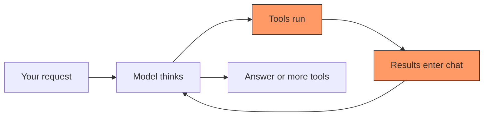
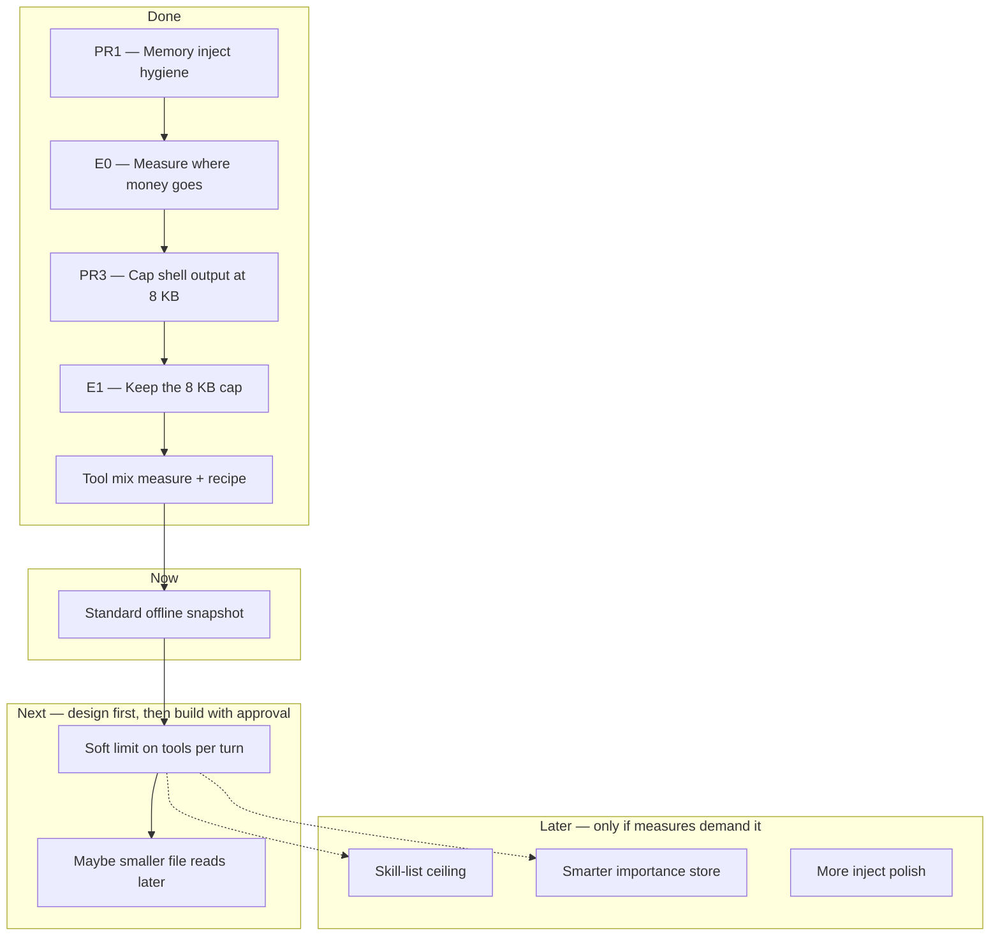
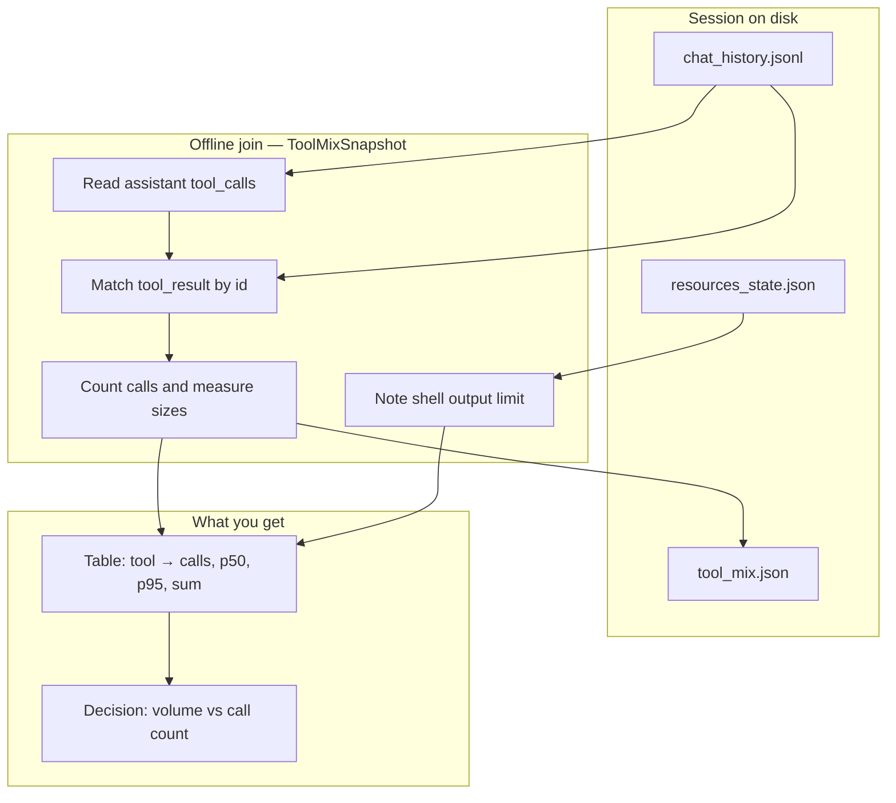
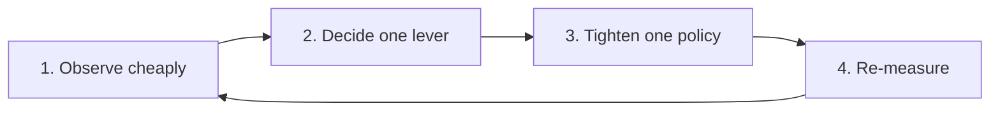
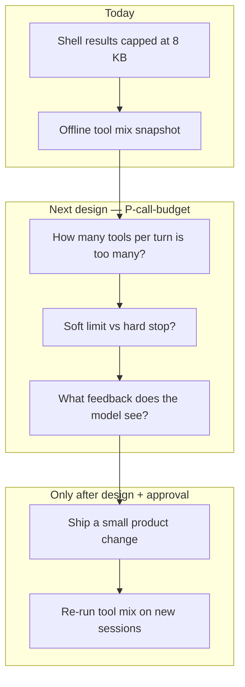

# Where we are going (and what we already fixed)

**Project:** Grok Build harness — cut learning cost (tokens, tools, money) without building features we do not need.  
**Date:** 2026-08-06  
**Audience:** future you, and any agent that resumes this work.

This note uses plain words. It avoids code-names unless it first says what they mean.

> **Folder:** `intelli-arch-designs/` — product-line design notes (direction, measures, next lever).  
> **Not** the end-user guide — that lives under `crates/codegen/xai-grok-pager/docs/user-guide/`.  
> **Operator memory mirror:** `~/.grok/memory/grok-build-fd8a03ef/harness-learning-cost-roadmap.md`

---

## One sentence goal

Make the agent **learn and ship code with less waste**: fewer huge tool dumps, fewer needless tool rounds, and fewer “measure by running a whole other agent” loops.

The product we edit **is** the harness we run. Saving tokens here pays every session after.

---

## The problem in plain terms

When you work with the agent, most of the bill is **not** the system prompt or the skill list.

It is this loop:

1. The model calls tools (shell, read file, search, …).
2. Each tool result is stuffed back into the chat.
3. The next model call pays for **all of that history again**.

So cost scales with:

**how many tools you call × how big each result is × how many rounds you take.**



**Red boxes** are where money burns. Fix those first.

---

## What we have already done

### Map of progress



### Done in detail

| Step | What we did | What we learned | Status |
|------|-------------|-----------------|--------|
| **PR1** | Fixed sticky memory inject: use config scores, cap size (~1500 chars). | Inject is **tiny** in the window (well under 5%). Correctness win, not a cost win. | Shipped |
| **E0** | Measured a real session: system vs messages vs skills vs tools. | **Tools and tool results** dominate. Skills ~2%. Inject ~0.2%. | Closed |
| **PR3** | Cut default shell tool output from **20 000** to **8192** chars; always set the limit in config. | Stops huge terminal dumps from filling the model context. Full log still on disk. | Shipped on product stack |
| **E1** | Checked that 8 KB still lets tasks succeed; mechanical cut ~59% on oversized dumps. | **Keep 8192.** Do not lower again without a real failure. | Closed — keep |
| **Tool mix** | Counted tools by name and result sizes on real sessions. | After the cap, shell is only ~43% of result size; **read file** is almost as big. **Call storms** (many tools in one turn) still hurt. | Closed |
| **Recipe** | Script + optional end-of-session hook writes `tool_mix.json`. Docs in sessions guide. | Re-rank the next lever **from files on disk** — no second agent experiment required. | Shipped as example + docs (PR #3) |

### Numbers that matter (one heavy session after the 8 KB cap)

| Fact | Value |
|------|--------|
| Tool calls | 88 |
| Result text (sum) | ~262 000 characters |
| Tools per user message (average / max) | ~6 / 28 |
| Shell share of result size | ~43% (cap binds on the largest ones) |
| Read-file share of result size | ~39% |
| Sticky memory inject | Still tiny vs tools |

**Translation:** we fixed the worst shell dumps. The remaining waste is **how often we call tools**, and large **file reads**, not “make the shell cap 4 KB.”

---

## How measurement works (architecture)

We do **not** need a new database to rank the next change.

Sessions already live on disk:

```text
~/.grok/sessions/<encoded-project-path>/<session-id>/
  chat_history.jsonl   ← model messages + tool calls + tool results
  resources_state.json ← tool settings (e.g. shell output limit)
  tool_mix.json        ← optional snapshot written at session end
```



**Command (after install):**

```bash
python3 ~/.grok/hooks/bin/tool-mix-observe.py ~/.grok/sessions/<encoded-cwd>/<session-id>
```

Optional: SessionEnd hook writes `tool_mix.json` when a session ends (fail-open if something is missing).

---

## Where we are heading

### Principle (repeat every time)



Do **not** build a full “importance learning” system first.  
Do **not** stack five half-finished caps.  
**Observe → one change → measure again.**

### Next step (not built yet)

**Soft call budget** — design first; ship only after human approval.

Ideas to design (not implement until agreed):

- Soft max tools per user turn (warn or stop the storm).
- Soft max shell calls per turn.
- Later: smarter file reads (offset/limit hygiene), if measures still show read size dominating.



### Explicitly parked (do not do next)

| Parked item | Why |
|-------------|-----|
| Lower shell default below 8192 | Cap already binds; shell is no longer alone in the volume chart |
| Re-run live 20k vs 8k A/B | Already decided; config miss made last A/B invalid |
| Skill-list ceiling | Not hot in the tool mix data |
| More inject polish | Inject is ≪5% of context |
| Full ML / importance store | Offline join + session files are enough for now |
| Clipboard debug panic fix | Real bug, separate track — do not block measure → tighten |

---

## Branch and product line (short)

- **Upstream:** xAI monorepo sync.  
- **Your product line:** personal patches on the default product branch (sticky inject + shell 8 KB + tool-mix recipe).  
- **Feature work:** branch → PR into the product line. Do not treat pure upstream `main` as the place for personal harness experiments unless your fork policy says so.

Use a **from-source** build when measuring harness changes. Stock binary may lag.

Do **not** nest a full second agent inside a live session to “measure” — it shares auth and can wedge the outer process. Prefer offline session files.

---

## How to resume in one minute

1. Read this file.  
2. Read the latest measure note if numbers matter:  
   `measurements/2026-08-05-tool-mix-observe.md`  
3. Next work is **design a soft tools-per-turn (or shell-per-turn) budget** — write the design, get approval, then implement.  
4. After any ship: run the tool-mix script on a new multi-tool session and compare to the table above.

---

## Links

| Artifact | Path or URL |
|----------|-------------|
| Memory index | `~/.grok/memory/grok-build-fd8a03ef/MEMORY.md` |
| E0 measure | `~/.grok/memory/grok-build-fd8a03ef/measurements/2026-08-05-e0-post-pr1-context.md` |
| PR3 design | `~/.grok/memory/grok-build-fd8a03ef/measurements/2026-08-05-pr3-bash-output-budget-design.md` |
| E1 measure | `~/.grok/memory/grok-build-fd8a03ef/measurements/2026-08-05-e1-bash-output-budget.md` |
| Tool mix measure | `~/.grok/memory/grok-build-fd8a03ef/measurements/2026-08-05-tool-mix-observe.md` |
| Script (hooks example) | [`../crates/codegen/xai-grok-hooks/examples/hooks/bin/tool-mix-observe.py`](../crates/codegen/xai-grok-hooks/examples/hooks/bin/tool-mix-observe.py) |
| PR tool-mix recipe | https://github.com/p10ns11y/grok-build/pull/3 |
| Focus essay (north star) | https://peramanathan-sathyamoorthy-cv.vercel.app/focus |

---

## Bottom line

| Question | Answer |
|----------|--------|
| What burns money? | Tool loops: many calls × large results × many rounds |
| What did we fix? | Shell dump size (8 KB default); inject correctness; a repeatable measure recipe |
| Are we done? | No — call storms and large file reads remain |
| What next? | Design a **soft call budget**; do not ship without approval |
| What not to do? | Another bash-cap spin, skill-list project, or ML store “for later” |

**We measure first. We change one thing. We measure again.**
