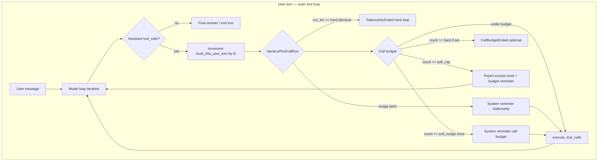
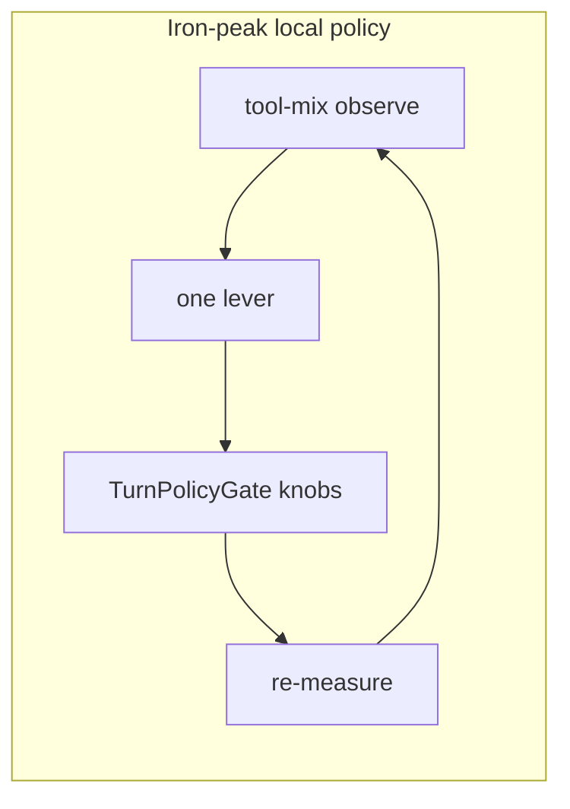
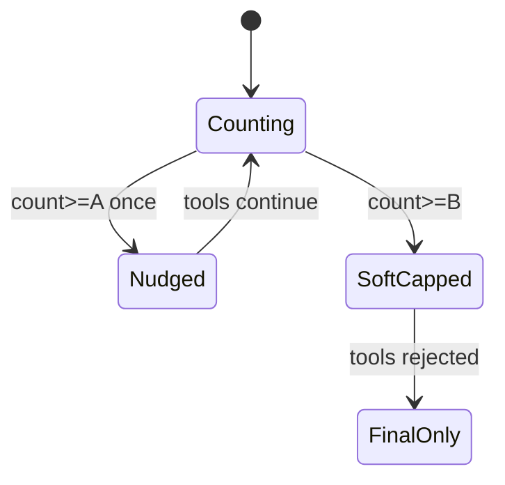
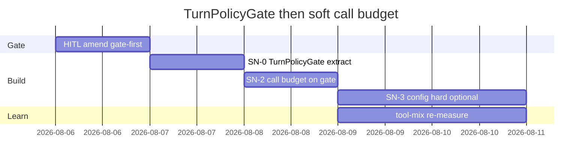

# Soft call budget — design note

**Status:** IMPLEMENTING thin — soft call budget **adjacent** to stationarity in `turn.rs` (no TurnPolicyGate extract)  
**Date:** 2026-08-06  
**Parent:** [harness-learning-cost-roadmap.md](./harness-learning-cost-roadmap.md)  
**Scope:** Local learning loop only. No fleet KDI / importance ML.  
**HITL amend (final):** Prefer **thin soft-call next to stationarity** for upstream merge hygiene. TurnPolicyGate extract is **parked** until a third throttle appears.

**North star (local half):** [Focus essay](https://peramanathan-sathyamoorthy-cv.vercel.app/focus)

---

## 1. One-sentence recommendation

Ship a **thin** soft call budget **next to** stationarity in `turn.rs` (no shared gate extract): tools per user turn, parallel **N**, shared pool — **nudge @ 12**, **soft-cap @ 20**, **hard-stop off**. Extract a TurnPolicyGate only if a third turn throttle appears.

---

## 2. HODA Executive Verdict

**Verdict:** Prefer **P-staged ∩ P-config-first** over nudge-only or hard-stop-first. Storm turns (max 28–73 tools/user_turn vs mean ~6) are the residual spend shape after Bash 8 KB; the iron-peak is a **single turn-scoped counter + staged gate** next to `IdenticalToolCallRun`, not another volume cap.

| Lens | Take |
|------|------|
| **Critical area** | Diverse multi-tool storms inflate context via *count × results*, not only identical polling |
| **First principles** | Cost ∝ tools × result size × model rounds; size partly fixed (PR3/E1); count is next local lever |
| **1st order** | Nudge reduces some storms; soft-cap bounds worst turns |
| **2nd order** | Soft-cap can force incomplete work → user re-prompts (new turns); mitigate with clear reminder + generous A/B vs mean |
| **3rd order** | Composable local policy knobs become the “observe → tighten” surface for years without fleet ML |
| **Invert / pre-mortem** | Silent hard-stop mid-task destroys trust; nudge-only is ignored on worst storms; separate pools fragment policy |
| **Antifragile** | Default **hard off**; soft thresholds high vs mean (~2× / ~3×); operator can raise/disable; never surprise-cut Bash &lt;8192 |
| **Thrive ascent (2036)** | Local measure→policy loop stays operator-owned; same *shape* as fleet focus essay without building fleet half |
| **Iron-peak** | `tools_this_user_turn` counter + staged gate in turn loop (reuse `push_system_reminder` / stationarity pattern) |

**Near-term confidence:** **72%** on unit + staged shape (strong code+measure fit).  
**Threshold numbers confidence:** **55%** (one host, few sessions; no p95 tools/user_turn distribution — use ranges and re-measure).  
**Thrive bet confidence:** **80%** that local policy levers beat inventing importance stores for this product line.

**Immediate next (after HITL):** implement only what the four gate elements lock; tool-mix before/after on a multi-tool session.

---

## 3. Answers to Q1–Q6

### Q1. Unit of budget

| Candidate | Use? | Why |
|-----------|------|-----|
| **Tools per user turn** | **Yes — primary** | Matches measure (`tools/user_turn`); storms are per-user-message spikes (21–73) |
| Per model loop iteration | Secondary only | `tool_turn_count` / `max_turns` already bound *rounds*; storms can dump many tools in one assistant message |
| Wall-clock turn | No | Not in session join today; hard to offline-verify |
| Bash-only subset | Not v1 | Residual is multi-tool; Bash + read_file share chars (~43% / ~39%); count is the lever |

**Definition:** count every `tool_calls[]` entry on assistant messages from the last `type=user` until the user turn ends (same definition as `tool-mix-observe.py` tools/user_turn).

### Q2. Soft vs hard

**Recommendation: staged**

| Stage | Threshold (draft) | Behavior |
|-------|-------------------|----------|
| **A — Nudge** | `soft_nudge_tools_per_user_turn` = **12** | One system reminder (latch once per user turn); tools still run |
| **B — Soft-cap** | `soft_cap_tools_per_user_turn` = **20** | Reject *further* tool executions this user turn with structured feedback; model may still emit a final answer (text / StructuredOutput) |
| **C — Hard-stop** | `hard_stop_tools_per_user_turn` = **null / 0 = off** | Optional later; if set, end turn like stationarity (`StationarityEnded`-style or dedicated outcome). **Default off** so identical-loop hard-stop stays owned by `IdenticalToolCallRun` |

**Not chosen**

- Nudge-only: measure max 28–73; reminder alone is weak against unbounded fan-out.
- Hard-first: trust risk; stationarity already hard-stops *identical* thrash (nudge@8, stop@16 / true-noop@4).

### Q3. Feedback surface

Mirror **action-stationarity** patterns in `turn.rs`:

| Stage | Channel | Analogy |
|-------|---------|---------|
| Nudge | `push_system_reminder` + template (tool-bridge render if needed) | `ACTION_STATIONARITY_NUDGE_TEMPLATE` @ `NUDGE_AFTER_IDENTICAL_TOOL_CALLS` (8) |
| Soft-cap | Do not execute excess tools; inject tool error / denial result *or* pre-exec gate + reminder “budget exhausted — answer or ask user” | Permission/hook deny path is adjacent; prefer explicit *budget* wording so model does not retry blindly |
| Hard-stop (if enabled) | End turn; telemetry category e.g. `call_budget` (not reuse `action_stationarity` string) | `TurnOutcome::StationarityEnded` pattern — new label preferred for metrics purity |
| Operator | tracing + unified_log + optional session event | `shell.turn.action_stationarity_nudge` / `_stop` |

**Template intent (draft, not final copy):**  
“You have used {n}/{cap} tools this user turn. Prefer reading less / batching conclusions. Further tool calls this turn will be rejected; give a final answer or ask the user.”

### Q4. Counting

| Question | Decision |
|----------|----------|
| Parallel `tool_calls` in one assistant message | Count **N** (each tool burns result tokens). Stationarity hashes the whole step as one *identity*; call budget cares about *volume*. |
| Shared vs separate pools | **One shared pool** for all tools in v1 (Bash, read_file, grep, subagent_out, …). Separate pools = more knobs without measure support. |
| Nested subagents | Count only parent-visible tools in v1 (`get_command_or_subagent_output` counts as 1). Nested-agent internal storms = parked (out of measure scope this loop). |
| When to increment | At accept/execute boundary of each tool (same place `turn_tools_called.push` runs today). Soft-cap checks **before** execute when `count >= B`. |

### Q5. Defaults (measure-grounded)

Evidence (2026-08-05 tool-mix, multi-tool sessions):

| Session class | tools/user mean | max |
|---------------|----------------:|----:|
| E1 post-PR3 | 5.87 | 28 |
| PR3 design | 5.74 | 49 |
| Heavy multi-tool | 8.55 | 73 |

Percentiles of tools/user_turn across turns: **unknown** (only mean/max published). Draft uses multipliers on mean and storm floor:

| Knob | Draft default | Grounding |
|------|---------------|-----------|
| `call_budget.enabled` | **true** (or `false` if HITL picks config-first strict) | See HITL element 4 |
| `soft_nudge_tools_per_user_turn` | **12** | ≈ 2× mean (~6); below storm cluster (21+) |
| `soft_cap_tools_per_user_turn` | **20** | Below min observed storm max (28); ≈ 3× mean |
| `hard_stop_tools_per_user_turn` | **0 / unset = off** | Refuse surprise hard ends; stationarity covers identical |
| `0` or omit on any threshold | disable that stage | Operator escape hatch |

**Unknown / ranges:** true p90/p95 of tools/user_turn may sit between 10–25; if post-ship task-fail rises, raise B to 24–28 before disabling.

### Q6. Measure-after (local loop)

**Recipe (unchanged join):**

```bash
python3 ~/.grok/hooks/bin/tool-mix-observe.py \
  ~/.grok/sessions/<url-encoded-cwd>/<session-id>
# or product example:
# crates/codegen/xai-grok-hooks/examples/hooks/bin/tool-mix-observe.py
```

Baseline: `~/.grok/memory/grok-build-fd8a03ef/measurements/2026-08-05-tool-mix-observe.md`  
(session `019fd29e-…`: 88 calls, mean 5.87, max 28).

| Success metric | Target (v1) | Falsify if |
|----------------|-------------|------------|
| **p95 or max tools/user_turn** on comparable multi-tool sessions | max ↓ toward ≤20–24 on non-exception work | max still 40+ with budget enabled *and* no soft-cap fires in logs |
| **mean tools/user_turn** | stable or slight ↓ (not primary) | mean collapses &lt;3 with clear incomplete tasks |
| **Task completion** (operator judgment / re-prompt rate) | no large ↑ in “had to re-ask” | soft-cap storms followed by failed goals ≥2 consecutive dogfood sessions |
| **Telemetry** | nudge/soft-cap fire counts visible | zero fires on known storm workloads → threshold too high or counter wrong |

**Not required for v1:** nested-agent A/B, Bash &lt;8192, skill-list ceiling.

---

## 4. Mermaid — budget vs stationarity in turn loop



**Fused abstraction (binding energy — iron-peak):**  
**TurnPolicyGate** = (identity stationarity ∥ volume call budget) sharing *reminder + optional end-turn* primitives, separate counters/reasons.

Traces:

- Stationarity: `crates/codegen/xai-grok-shell/src/session/acp_session_impl/turn.rs` (`IdenticalToolCallRun`, nudge@8, stop@16)
- Volume counter seed: same file `turn_tools_called` / loop before `execute_tool_calls`
- Config opt-in pattern: `LazinessDetectorPerModelConfig` / Bash `output_byte_limit` in agent + tools config



---

## 5. Touch list

| Area | Path / symbol | Status |
|------|---------------|--------|
| Thin soft-call | `acp_session_impl/turn.rs` — `SoftCallBudget` | **In tree** (+~160 lines, additive only) |
| Stationarity | same file `IdenticalToolCallRun` | **Unmoved** (upstream-friendly) |
| Telemetry | unified_log | `shell.turn.call_budget_nudge` / `_soft_cap` |
| Config TOML | agent/config | **Parked** — consts `SOFT_CALL_BUDGET_NUDGE=12`, `_CAP=20` |
| TurnPolicyGate extract | — | **Parked** |
| Docs | user-guide | After dogfood |

**Do not touch for v1:** Bash default 8192, skill list, sticky inject, nested agent runtime budgets, fleet stores.

---

## 6. Config surface sketch

Names are sketch-level (serde snake_case); final names follow existing config style in PR.

```toml
# Sketch — exact table path TBD (session or agent config)
[call_budget]
enabled = true
# 0 = stage disabled
soft_nudge_tools_per_user_turn = 12
soft_cap_tools_per_user_turn = 20
hard_stop_tools_per_user_turn = 0
```

| Behavior | Rule |
|----------|------|
| `enabled = false` | No count, no reminders, no rejects (stationarity still on) |
| threshold `0` / omit | That stage off |
| soft_cap &lt; soft_nudge (misconfig) | Clamp or treat nudge = soft_cap − ε; fail closed to safer (higher) thresholds in resolve |
| **Off behavior** | Identical to today’s turn loop + stationarity only |

**Default product posture (recommended):** enabled with A=12, B=20, C=off.  
**Strict config-first amend:** enabled=false until operator opts in (antifragile max).

---

## 7. Local verify plan

1. **Baseline:** tool-mix on ≥1 multi-tool session (or cite 2026-08-05 note).  
2. **Ship call budget** (separate PR after this HITL + implement HITL).  
3. **Dogfood** a comparable multi-tool coding session on from-source build.  
4. **Compare:** max/mean tools/user_turn; presence of soft-cap fires; task outcome.  
5. **Falsify design if:** (a) storms unchanged with counter never incrementing; (b) soft-cap fires every light turn (threshold too low); (c) operator disables after one session due to trust (feedback copy wrong).

---

## 8. Parked items

| Item | Why parked |
|------|------------|
| Fleet / KDI / importance ML | Out of product-line scope |
| Bash default &lt; 8192 | E1 KEEP; diminishing ROI |
| Separate Bash/read pools | No measure demand yet |
| Nested-agent internal call budgets | Method cost noted; not in v1 counter semantics |
| Skill-list ceiling / sticky inject rework | Not hot in tool-mix |
| Hard-stop default on | Trust; stationarity covers identical |
| read_file offset/limit hygiene | Next volume lever *after* call budget re-measure |
| Full p95 DOE across many sessions | Nice; not blocking staged v1 |

---

## Pathways simulated (compact)

| Pathway | short_step | tipping | signpost → |
|---------|------------|---------|------------|
| **P-nudge-only** | Reminder @ A | Model ignores @ storms 28+ | max still high → **switch** to soft-cap |
| **P-soft-cap** | Reject tools @ B | Incomplete tasks / re-prompts | re-prompt↑ → raise B or **Ask** |
| **P-staged** ★ | A then B; C off | Best risk/cost balance | — **continue** as recommended |
| **P-config-first** | Knobs; default off/high | No learning if never enabled | if default off forever → **Ask** enable for dogfood |

**pathway_active:** P-staged + config knobs (C off). Switch to pure config-first default-off if HITL element 4 says so.

---

## Scorecard (evidence)

| Claim | Grade | Evidence |
|-------|-------|----------|
| Call count is residual lever | A | tool-mix 2026-08-05: Bash~43% chars, read~39%; max tools/turn 28–73 |
| Stationarity ≠ call budget | A | `IdenticalToolCallRun` identity hash; diverse storms still free |
| Soft stages exist in harness | A | nudge@8 / stop@16 + `push_system_reminder` in `turn.rs` |
| Default thresholds exact | C | mean/max only; no p95 distribution |
| Soft-cap safe for all tasks | C | unknown; mitigate with B≈20 and operator disable |

---

## Blueprint cards (implementation order — gate first)

### SN-0 · TurnPolicyGate extract (FIRST)

**Problem:** Stationarity and call budget both need nudge / soft-reject / hard-stop without duplicating turn-loop glue.

| File | Work |
|------|------|
| `acp_session_impl/turn_policy_gate.rs` | `TurnPolicyEffect`, `TurnPolicyKind`, `IdenticalToolCallRun`, `CallBudgetState`, `TurnPolicyGates` |
| `turn.rs` | wire `pre_sample` / `pre_execute` / `record`; delete inlined stationarity |
| tests | move + extend unit tests on gate module |

**Done when:** Stationarity behavior unchanged; gate unit tests green; soft call budget can add only volume policy.  
**Verify:** `cargo test -p xai-grok-shell --lib turn_policy_gate`; mid-turn stationarity integrity test.

### SN-1 · Dogfood / HITL lock

**Problem:** Confirm thresholds and default on/off.

| File | Work |
|------|------|
| this design | Status APPROVED + amend (gate first) |

**Done when:** Operator amend recorded (this section).  
**Verify:** — 

### SN-2 · Call budget on TurnPolicyGate (nudge + soft-cap)

**Problem:** No volume counter on diverse storms.



| File | Work |
|------|------|
| `turn_policy_gate.rs` | `CallBudgetConfig` defaults 12 / 20 / hard 0 |
| `turn.rs` | soft-cap deny tool_results + reminder; count N |

**Done when:** Nudge once at A; soft-cap rejects further tools; disabled config = no-op.  
**Verify:** gate unit tests; dogfood tool-mix after ship.

### SN-3 · Optional hard-stop + config surface (later)

**Problem:** Soft-cap ignored in pathological loops; operator knobs.

| File | Work |
|------|------|
| agent/config or resources | expose enabled / A / B / C |
| types/events | dedicated `CallBudgetEnded` if hard path used in production |

**Done when:** hard=0 default; TOML knobs optional.  
**Verify:** unit + config parse tests.

---

## Gantt (sprint order — amended)



---

## HITL gate (≤4 decision elements)

Human: **approve** / **amend** / **abort**

| # | Element | Recommended |
|---|---------|-------------|
| 1 | **Unit** | Tools per **user turn**, parallel = **N**, **shared** pool |
| 2 | **Soft threshold (nudge A)** | **12** |
| 3 | **Hard threshold** | **None** (soft-cap **20** only; C off) |
| 4 | **Default on/off** | **On** with A=12, B=20 (amend → off until opt-in) |

Product code remains **blocked** until this gate clears and a **separate** implement session/PR starts.

---

## Guardrails (refuse vs build)

| Refuse | Build toward 2036 |
|--------|-------------------|
| Fleet KDI store “because focus essay” | Local observe → one knob → re-measure |
| Lower Bash &lt;8192 as this lever | Turn-scoped volume gate |
| Hard-stop default on diverse tools | Staged soft policy + stationarity for identical |
| Mega-PR (budget + read hygiene + skills) | SN-2 → SN-3 → measure → maybe SN-4 / read hygiene |

---

## References

| Artifact | Path / URL |
|----------|------------|
| Roadmap | [harness-learning-cost-roadmap.md](./harness-learning-cost-roadmap.md) |
| Tool-mix measure | `~/.grok/memory/grok-build-fd8a03ef/measurements/2026-08-05-tool-mix-observe.md` |
| Stationarity | `crates/codegen/xai-grok-shell/src/session/acp_session_impl/turn.rs` |
| Focus essay | https://peramanathan-sathyamoorthy-cv.vercel.app/focus |

---

**Plain rule:** Bound *how many* tools a turn may burn before you bound another *kind* of dump — and always re-measure from session files on disk.
